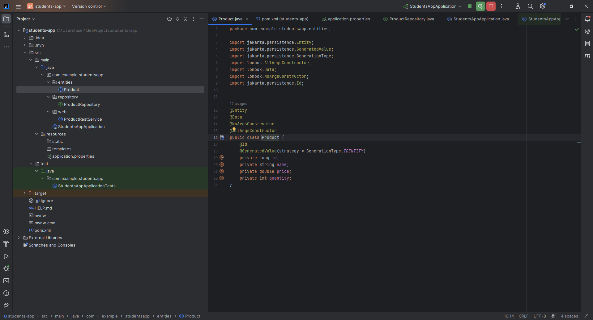

# Spring Boot Product Management Application

This project is a Spring Boot application for managing products. It uses JPA for data persistence, H2 for the initial in-memory database, and later migrates to MySQL for production.

## Getting Started

To get started with this project, follow these steps:

### Prerequisites

- Java 8 or higher installed
- Maven installed
- IntelliJ IDEA Ultimate installed
- xampp installed

### Installation

1. Clone the repository.
   ```bash
   git clone https://github.com/faroukmanar/TP2-JEE.git
    ```
2. Open the project in IntelliJ IDEA.
3. Run the project.
4. Open a web browser and navigate to `http://localhost:8085`.

## Usage

The application allows you to perform the following operations:

- Create a new product
- Update an existing product
- Delete a product
- View a list of all products
- View a product by ID
- Search for a product by name
- Sort products by name, price, or category

## Objectives

- Learn how to create a Spring Boot application
- Learn how to use JPA for data persistence
- Learn how to use H2 for an in-memory database
- Learn how to migrate from H2 to MySQL

## Technologies

- Java
- Spring Boot
- JPA
- H2
- MySQL
- Lombok


## Resources

- [Spring Boot](https://spring.io/projects/spring-boot)
- [JPA](https://spring.io/projects/spring-data-jpa)
- [H2](https://www.h2database.com/html/main.html)
- [MySQL](https://www.mysql.com/)
- [Lombok](https://projectlombok.org/)
- [IntelliJ IDEA](https://www.jetbrains.com/idea/)

## Screenshots of the application
1. Creation of Spring project with the dependencies JPA, H2, Spring Web, and Lombok
* Project creation
  
* Dependencies
  
2. Creation of the JPA entity Product with the attributes:

   `id of type Long`,
   `name of type String,`,
   `price of type double,`,
   `quantity of type int`.



3. Configuration of the perstance properties in the application.properties file


4. Creation of the ProductRepository interface that extends the JpaRepository interface


5. Tests of the ProductRepository interface


6. Merge From H2 to MySQL


7. Implementation of the Restful API ProductRestService


Thank you